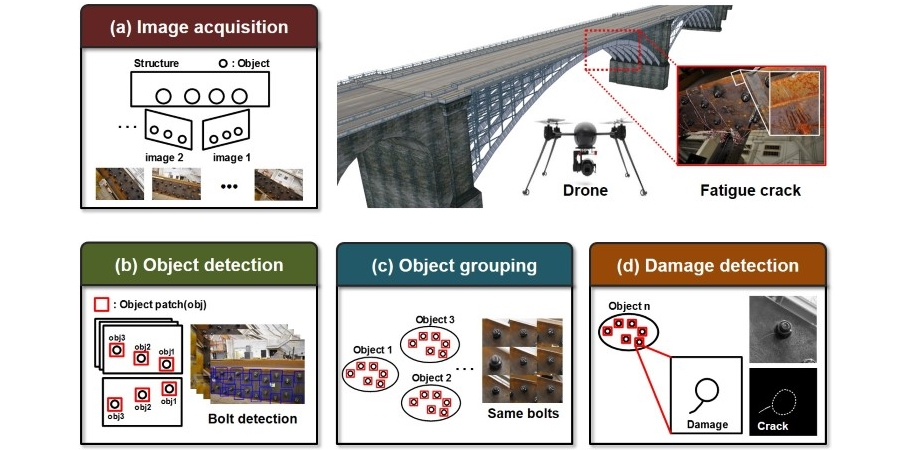
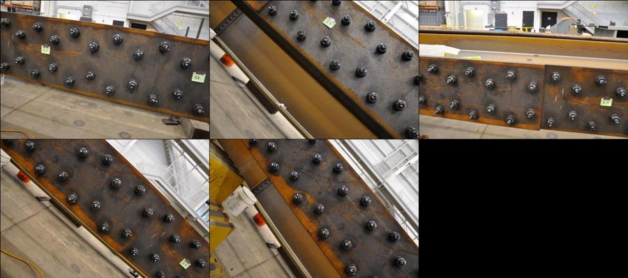
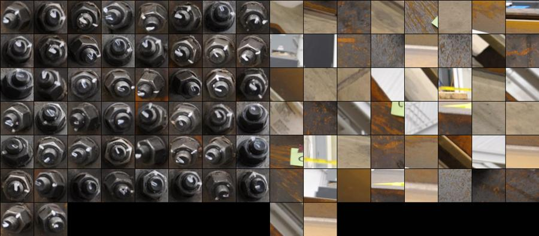
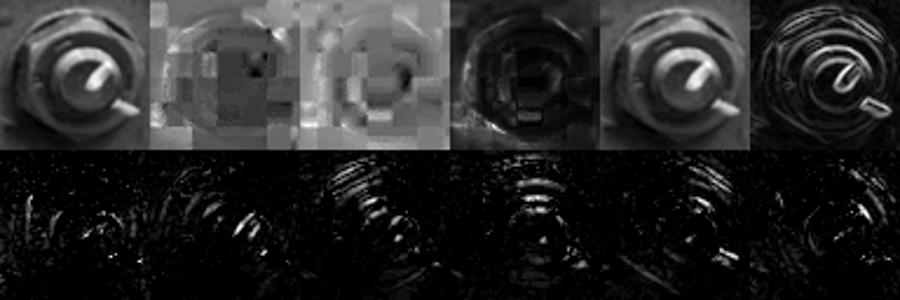
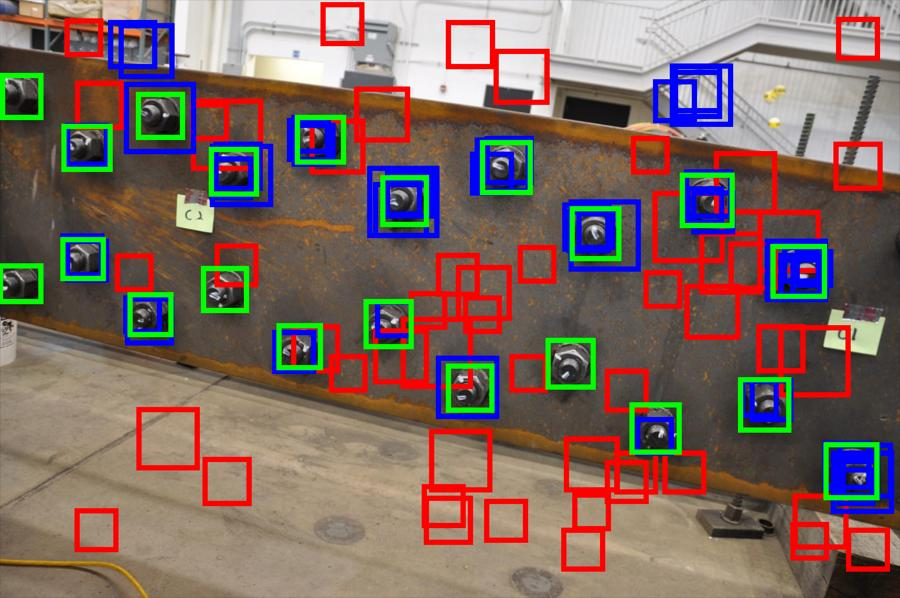
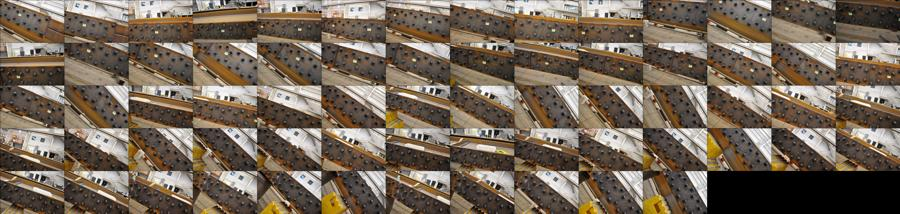
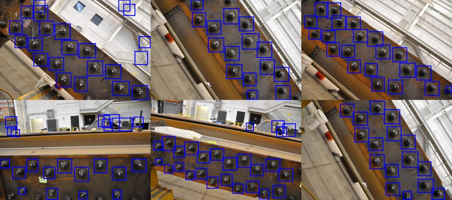
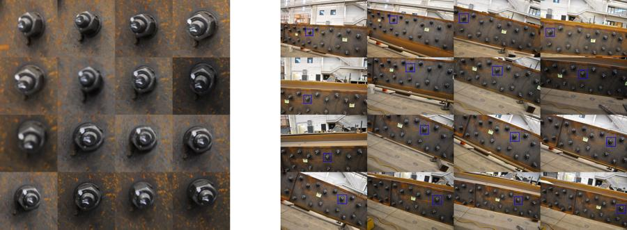
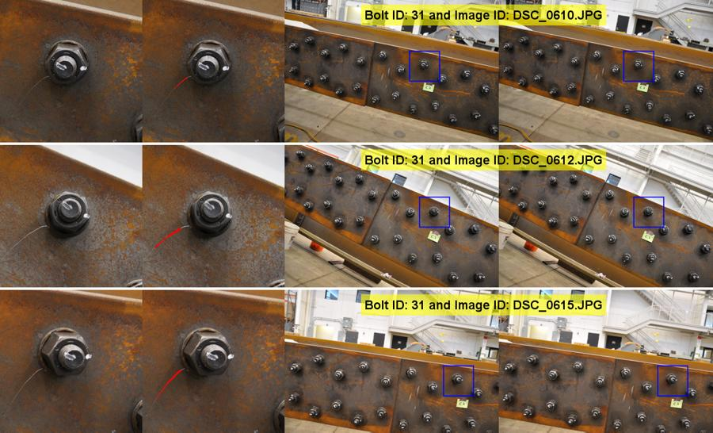
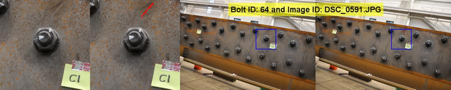

## Vision-Based Automated Crack Detection for Bridge Inspection

 

## Description
Visual inspection of civil infrastructure is customarily used to identify and evaluate faults such as cracks, corrosion, or deformation. However, current procedures followed by human inspectors demand long inspection times to cover large and difficult to access bridges, and rely strongly on the inspector’s subjective or empirical knowledge. To address these limitations, a new vision-based visual inspection technique is proposed by automatically processing and **analyzing a large volume of collected images from unspecified locations using computer vision algorithm**. By evaluating images from many different angles and utilizing knowledge of a fault’s typical appearance and characteristics, the proposed technique can successfully detect faults on a structure. 

## Publication
**Chul Min Yeum** and Shirley J Dyke. “Vision-Based Automated Crack Detection for Bridge Inspection.” Computer-Aided Civil and Infrastructure Engineering 30, no. 10 (2015): 759–770.[**[Web]**](http://onlinelibrary.wiley.com/doi/10.1111/mice.12141/abstract),[**[Paper]**](http://chulminy.github.io/cv/Files/Journal/2015_CACAIE_Vision_Based_Automated.pdf)

**Chul Min Yeum** and Shirley J. Dyke. “Vision-based Automated Visual Inspection of Large-scale Bridges”. Sixth World Conference on Structural Control and Monitoring, July, 2014. [**[Paper]**](http://chulminy.github.io/cv/Files/Conference/2013_6WCSM_Paper.pdf),[**[PPT]**](http://chulminy.github.io/cv/Files/Conference/2013_6WCSM_PPT.pdf) 

## Source Code & Data
* All source code are released in this repository. 
* You can download original images and results from this link [[**Link**]](https://www.amazon.com/clouddrive/share/4e54SCoGGtkK6dUWN2VlLAPmwWQfMdjcM5RcmDFgGi?ref_=cd_ph_share_link_copy). 
* If you use the codes and images for your publication, **please cite my paper(s).**

## Collaborators
[**Shirley J. Dyke**](https://engineering.purdue.edu/IISL/)

## Acknowledgment
I acknowledge support from National Science Foundation under Grant No. NSF-CNS-1035748. I would like to thank Dr. Robert J. Connor and Matt Hebdon at Purdue for providing the test structure and invaluable comments for this study.
 
## Setup

**Show the outcomes in the paper**  

1. Clone (or download) the source code in github into a directory of your choice. 
2. Download and unzip images and output data from the above link and allocate them in the same directory. In the directory, you will have folders of "code","img" and "post". You can manually setup the path of "img" in `Parameters.m`.
3. Run `RunOutput.m`. 

**Train your own classifier using your images**
  
1. Clone (or download) the source code in github into a directory of your choice. 
2. Manually annotate your object-of-interest using `RunLabeling.m`. 
3. Run `RunTrainClassifier.m` and `RunTest.m`, consecutively. However, you have to modify and update parameters in `Parameters.m`, applicable to your own application.
4. I would recommend that you first understand the flow of the code using my images.  

##Sample Outcome 

###Training images
**Five images collected from the same structure were used for training.**

 

###Positive and negative patches for training 

**Positive (right) and negative (left) patches were annotated and extracted from the training images.**

 

###Show channel patches

**A total of 11 channel images are used to extract features, including U and V components in LUV, H and S components in HSV, gradient, and histogram of gradient with 6 orientations (0°, 30°, 60°, 90°, 120°, 150°).**

 

###Show classified patches on training images

**Green,blue, and red boxes indicate ground-truth bolt annotations, detected positive patches, and detected negative patches, respectively.**

 

###Show testing images

**All 67 images are used for testing.**

 

###Show detected objects

**Blue boxes indicate detected positive patches.**

 

###Show a group of each bolt

**All 68 bolts are successfully grouped. The bolt patches on the right indicate same bolt, extracted from test images on the left.**

 

###Show crack detection results

**Crack detection on the Bolt (a): The red line is the detected crack.** 

   

**Crack detection on the Bolt (b): The red line is the detected crack** 

